# LAB15 - Analyse Dynamique Android avec Frida

Rapport de laboratoire sur l'analyse dynamique d'une application Android et le contournement du SSL pinning avec Frida, Burp Suite et des hooks Java/natifs.

> Ce travail est realise dans un cadre pedagogique et autorise. Les techniques de bypass SSL pinning doivent etre utilisees uniquement sur des applications de test, des appareils personnels ou dans un audit explicitement autorise.

## Objectif du lab

L'objectif etait de preparer un environnement d'analyse dynamique Android, d'intercepter le trafic HTTPS d'une application cible, puis de neutraliser le SSL pinning afin de valider que les requetes HTTPS deviennent visibles dans Burp Suite.

Application cible utilisee :

- Nom : `SSL Pinning Demo`
- Package : `tech.httptoolkit.pinning_demo`
- Appareil : Android Emulator `emulator-5554`
- Outils : `adb`, `Frida 17.10.1`, `Burp Suite`, `Python 3.12.10`

## Structure du depot

```text
.
|-- README.md
|-- docs/
|   |-- lab-summary.md
|-- evidence/
|   |-- screenshots/
|   |-- raw/
|-- scripts/
|   |-- sslpin_bypass_universal.js
|   |-- sslpin_okhttp_fix.js
|   |-- sslpin_bypass_native.js
|-- .gitignore
```

## Etape 1 - Verification de l'environnement

J'ai commence par verifier les prerequis cote PC : Python, pip, ADB et la connexion de l'emulateur Android.

Commandes executees :

```powershell
python --version
pip --version
adb --version
adb devices
```

Resultats observes :

- Python installe : `Python 3.12.10`
- pip installe : `pip 25.0.1`
- ADB installe : `Android Debug Bridge version 1.0.41`
- Appareil connecte : `emulator-5554 device`

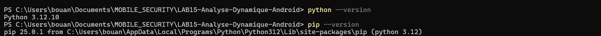

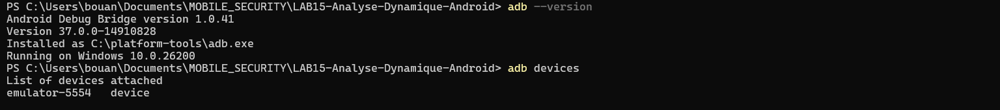

## Etape 2 - Configuration du proxy

Pour intercepter le trafic HTTPS, j'ai configure Burp Suite sur le port `8080`, puis j'ai force l'emulateur Android a utiliser le proxy du poste hote.

Commande executee :

```powershell
adb shell settings put global http_proxy 10.0.2.2:8080
adb shell settings get global http_proxy
```

La valeur retournee confirme que le proxy Android pointe vers Burp :

```text
10.0.2.2:8080
```

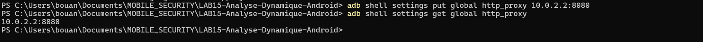

## Etape 3 - Installation du certificat CA

Pour permettre l'inspection TLS, j'ai prepare l'installation du certificat CA de Burp sur l'appareil Android. Le certificat `burplab15.cer` a ete place dans les telechargements puis installe comme certificat CA utilisateur.

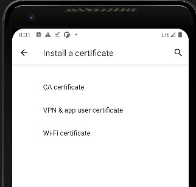

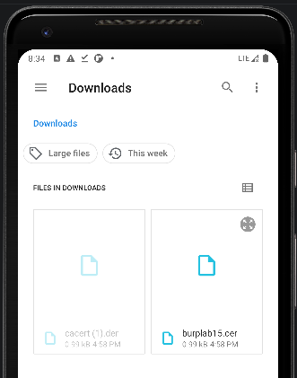

## Etape 4 - Validation initiale avec le navigateur

Avant de lancer le bypass sur l'application cible, j'ai teste le proxy avec Chrome sur l'emulateur. Le site Meteored/Tameteo s'ouvre correctement, ce qui confirme que l'emulateur sort bien vers Internet via le proxy configure.

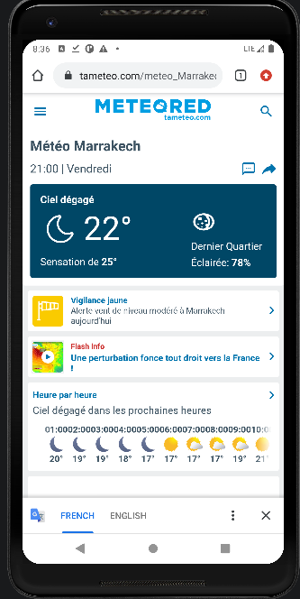

Dans Burp Suite, les requetes HTTPS du navigateur apparaissent avec les domaines, les chemins, les methodes HTTP et les codes de statut.

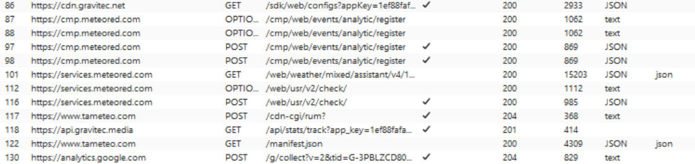

## Etape 5 - Identification de l'application cible

J'ai ensuite liste les applications/processus Android visibles par Frida afin d'identifier le package cible.

Commande executee :

```powershell
frida-ps -Uai
```

L'application cible apparait dans la liste :

```text
SSL Pinning Demo    tech.httptoolkit.pinning_demo
```

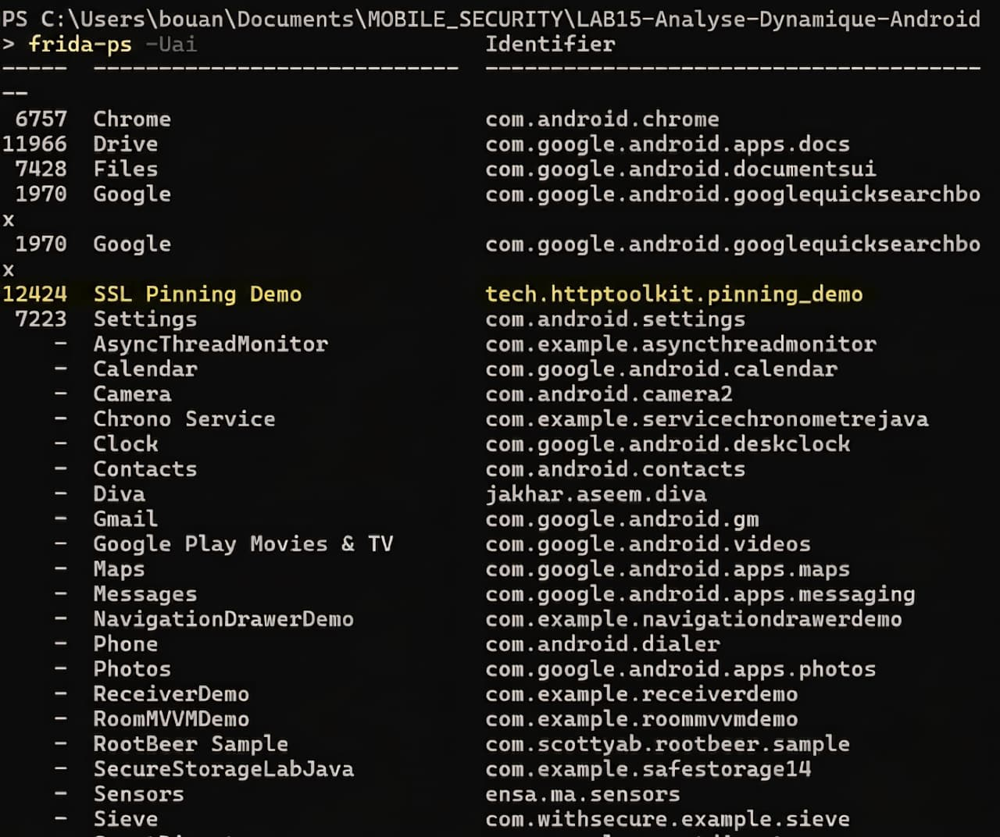

Pour filtrer plus rapidement les applications liees au SSL pinning, j'ai utilise :

```powershell
frida-ps -Uai | Select-String -Pattern "pinning|ssl|https|demo|okhttp"
```

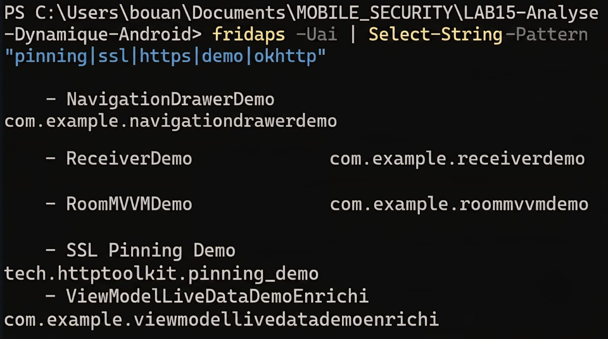

## Etape 6 - Injection Frida et bypass Java

J'ai charge le script `scripts/sslpin_bypass_universal.js` sur le processus de l'application cible. Ce script patch plusieurs points classiques du SSL pinning Android :

- `SSLContext.init`
- `TrustManagerImpl` de Conscrypt
- `OkHttp CertificatePinner`
- `WebViewClient.onReceivedSslError`

Commande utilisee en mode attach :

```powershell
frida -U -p <PID_APP> -l .\scripts\sslpin_bypass_universal.js
```

La console Frida confirme le chargement du script et l'installation des hooks :

```text
[+] Script SSL Pinning Bypass charge
[+] SSL bypass: SSLContext.init patche
[+] SSL bypass: com.android.org.conscrypt.TrustManagerImpl patche
[+] SSL bypass: OkHttp CertificatePinner patche
[+] SSL bypass: WebViewClient patche
[+] Universal SSL pinning bypass installe
```

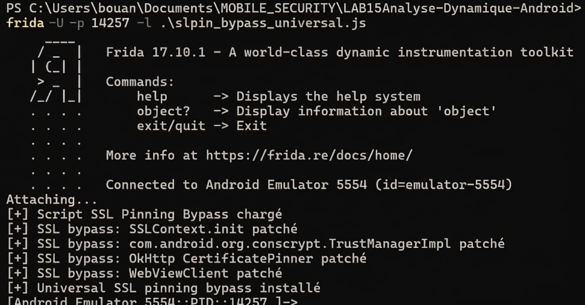

## Etape 7 - Ajout d'un bypass specifique OkHttp

Comme l'application cible teste plusieurs variantes de pinning, j'ai ajoute un second script specialise sur OkHttp :

```powershell
frida -U -p <PID_APP> -l .\scripts\sslpin_bypass_universal.js -l .\scripts\sslpin_okhttp_fix.js
```

Le script confirme :

```text
[+] OkHttp SSL pinning bypass loaded
[+] OkHttp CertificatePinner patched
[+] OkHttp hostname verifier patched
[+] OkHttp bypass installed
```

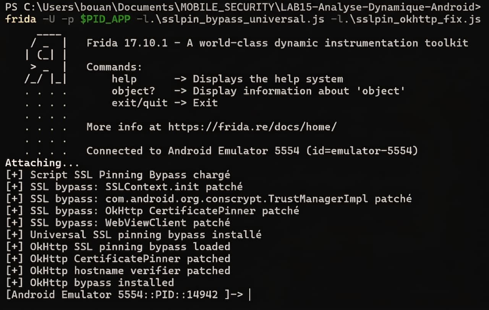

## Etape 8 - Ajout d'un bypass natif

Pour couvrir les cas ou la verification TLS passe par BoringSSL/OpenSSL ou une librairie native, j'ai aussi prepare un hook natif.

Commande utilisee :

```powershell
frida -U -p <PID_APP> -l .\scripts\sslpin_bypass_native.js
```

Le script trouve et hooke les symboles :

```text
[+] Found SSL_get_verify_result in libssl.so
[+] Hook installed on SSL_get_verify_result
[+] Found X509_verify_cert in libcrypto.so
[+] Hook installed on X509_verify_cert
```

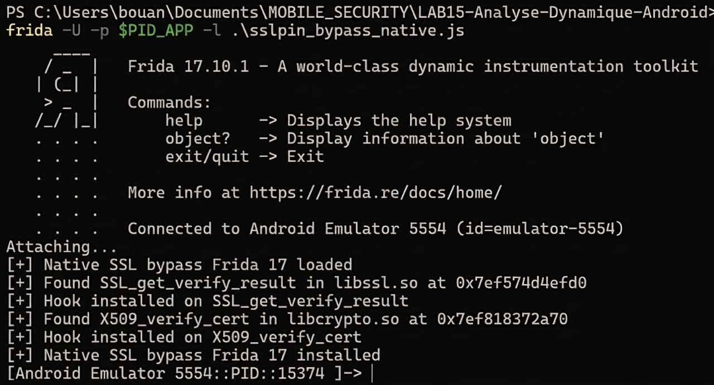

## Etape 9 - Validation dans l'application SSL Pinning Demo

Apres injection des scripts, plusieurs boutons de test de l'application `SSL Pinning Demo` passent en vert. Cela indique que les requetes epinglees sont acceptees malgre le certificat intercepte par Burp.

Tests visibles comme reussis :

- `CONFIG-PINNED REQUEST`
- `CONTEXT-PINNED REQUEST`
- `VOLLEY PINNED REQUEST`
- `TRUSTKIT PINNED REQUEST`
- `APPMATTUS+RAW TLS CT`

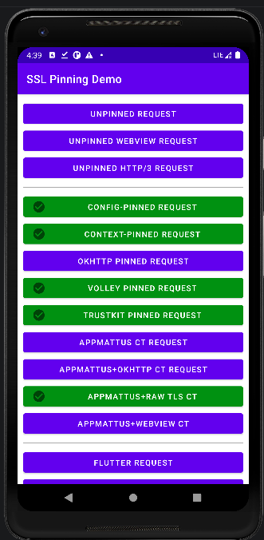

## Etape 10 - Validation finale dans Burp Suite

La preuve finale est la presence dans Burp Suite de requetes vers `badssl.com`, notamment :

- `https://sha256.badssl.com`
- `https://ecc384.badssl.com`

Les requetes retournent le statut `200`, ce qui confirme que le trafic HTTPS de l'application cible a ete intercepte et dechiffre apres bypass du SSL pinning.

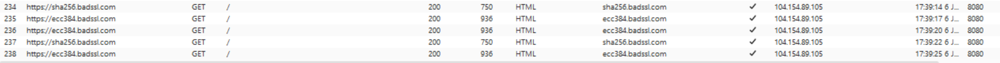

## Scripts fournis

Les scripts utilises sont disponibles dans le dossier `scripts/` :

- `sslpin_bypass_universal.js` : bypass Java generique pour TrustManager, Conscrypt, OkHttp et WebView.
- `sslpin_okhttp_fix.js` : hooks complementaires pour OkHttp et HostnameVerifier.
- `sslpin_bypass_native.js` : hooks natifs sur `SSL_get_verify_result` et `X509_verify_cert`.

## Conclusion

Le lab a permis de mettre en place une chaine complete d'analyse dynamique Android :

1. Verification de l'environnement PC et ADB.
2. Connexion de l'emulateur Android.
3. Configuration du proxy Burp Suite.
4. Installation du certificat CA.
5. Identification de l'application cible avec Frida.
6. Injection de scripts de bypass SSL pinning.
7. Validation dans l'application et dans Burp Suite.

Le resultat final montre que le trafic HTTPS de l'application cible peut etre capture dans Burp Suite apres neutralisation des controles de pinning.
